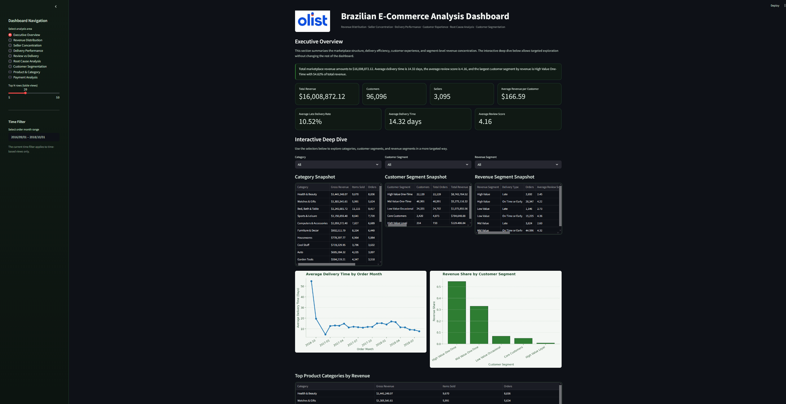
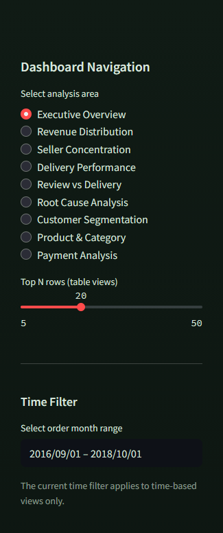
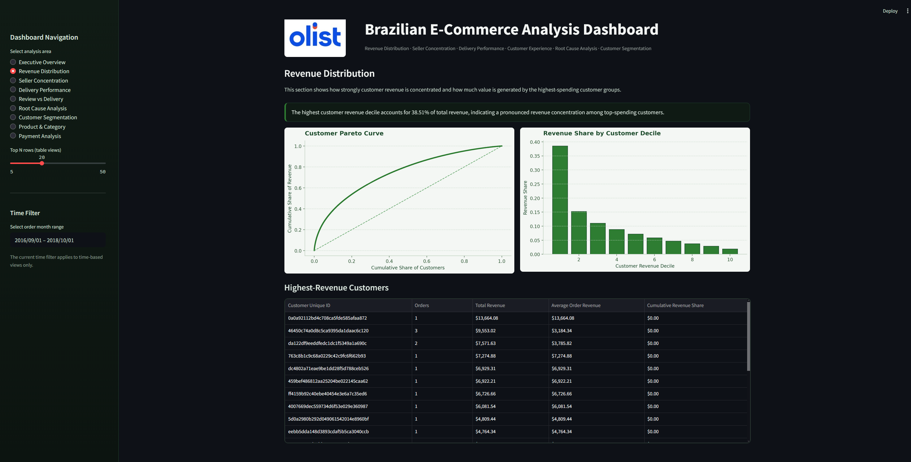
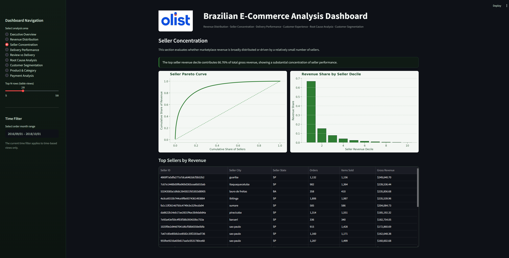
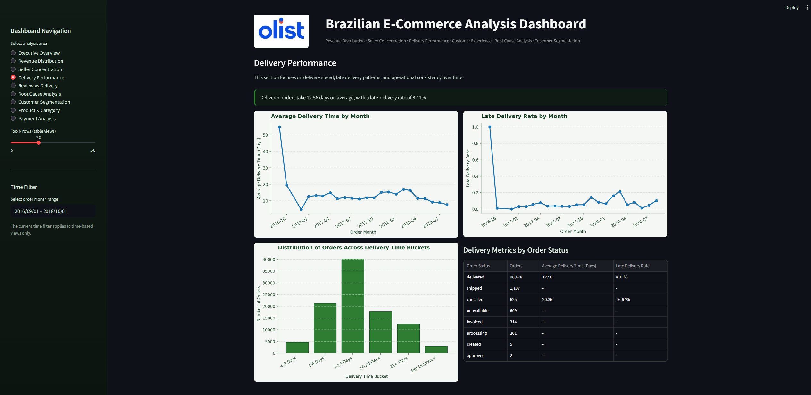
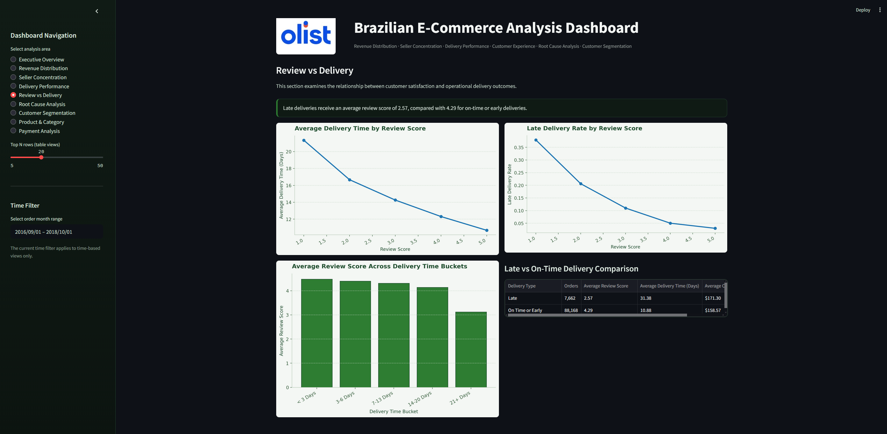
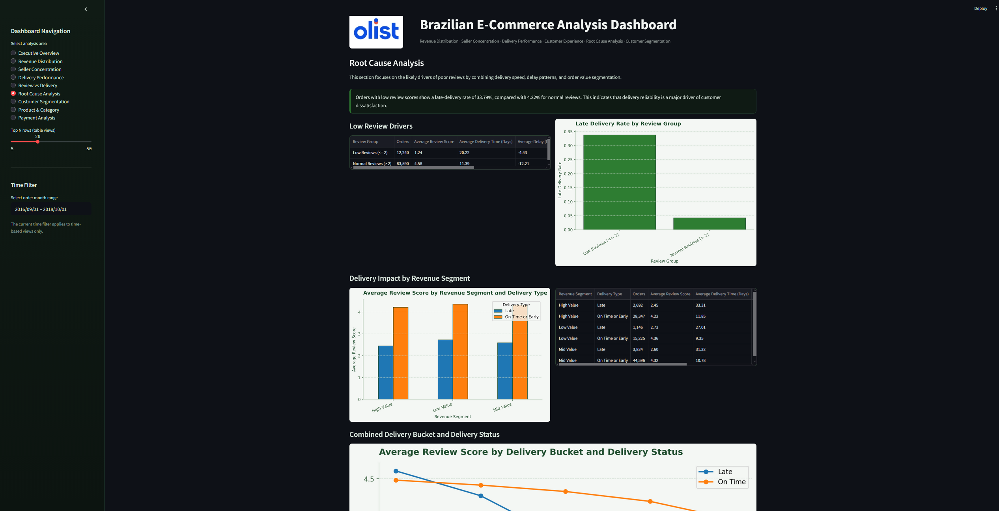
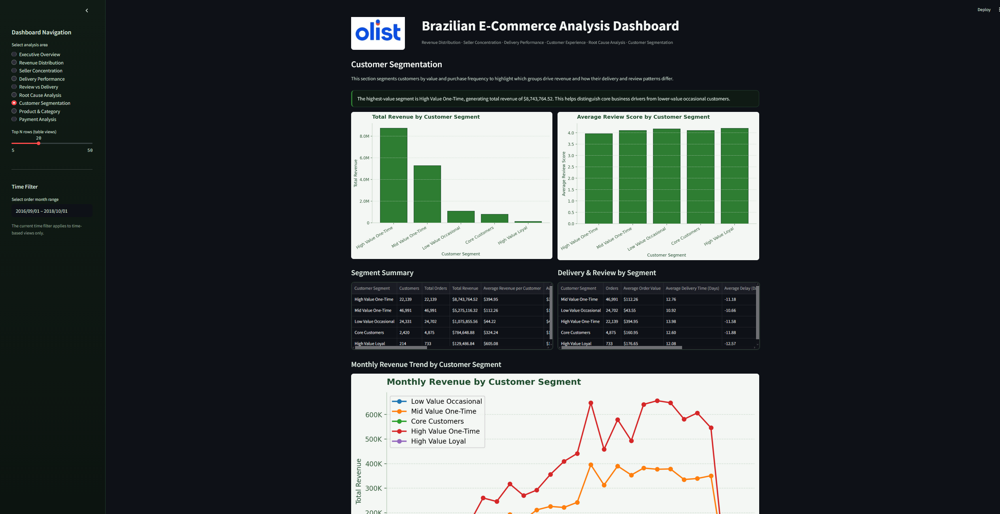
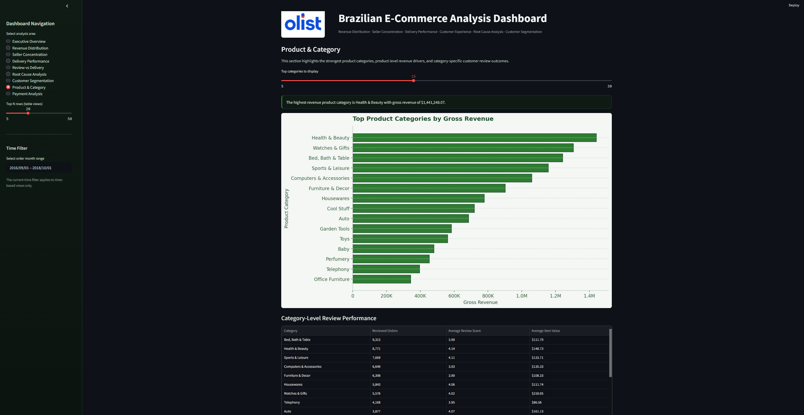
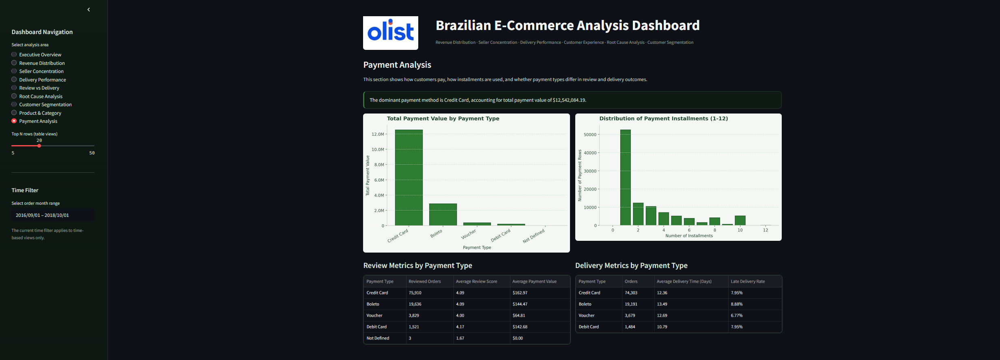

# Brazilian E-Commerce Analysis (Olist)

**Business Intelligence · Explorative Analyse · Ad-hoc Analytics**

End-to-End Analyseprojekt auf Basis realer Marktplatzdaten (Olist, Brasilien).  
Ziel ist der Aufbau einer strukturierten Analysebasis, die operative Zusammenhänge sichtbar macht und flexible, ad-hoc Auswertungen ermöglicht.

[Zur vollen Dokumentation](docs/documentation.md)
---

## Executive Summary

Dieses Projekt analysiert einen realen E-Commerce-Marktplatz anhand von Transaktionsdaten.

Zentrale Erkenntnisse:

- **Umsatz ist stark konzentriert** auf wenige Kunden und Seller  
- **Delivery Performance ist der wichtigste Treiber der Kundenzufriedenheit**  
- **Kundenstruktur ist unausgewogen** (wenige High-Value-Kunden vs. viele Low-Value-Kunden)  

**Kernaussage:**  
Operative Faktoren – insbesondere Lieferzeiten – bestimmen maßgeblich die Customer Experience und damit die Gesamtperformance des Marktplatzes.

---

## Dashboard Overview



---

## Business Context

Ein Online-Marktplatz verbindet:

- Kunden (Nachfrage)
- Seller (Angebot)
- Produkte
- Logistikprozesse
- Zahlungsabwicklung

Typische Herausforderungen:

- ungleiche Umsatzverteilung (Pareto-Struktur)
- heterogene Performance zwischen Sellern und Kategorien
- inkonsistente Delivery-Prozesse
- direkte Abhängigkeit zwischen Operations und Customer Experience

**Zentrale Herausforderung:**  
Business-Fragen entstehen oft spontan – es fehlt eine strukturierte Analysebasis für schnelle und fundierte Antworten.

---

## Ziel des Projekts

Ziel ist der Aufbau einer Analyse- und Reportingstruktur, die:

- **Ad-hoc Analysen ermöglicht**
- Daten konsistent strukturiert
- KPIs klar definiert
- Zusammenhänge zwischen Bereichen sichtbar macht

Leitfrage:

> Wie lassen sich reale Marktplatzdaten so modellieren, dass operative Performance und Customer Experience gemeinsam analysiert werden können?

---

## Dashboard-Struktur

- Executive Overview  
- Revenue Distribution  
- Seller Concentration  
- Delivery Performance  
- Review vs Delivery  
- Root Cause Analysis  
- Customer Segmentation  
- Product & Category  
- Payment Analysis  



---

## Zentrale Analyseergebnisse

### 1. Umsatzkonzentration (Customer Perspective)



- klare Pareto-Struktur  
- Top-Kunden generieren Großteil des Umsatzes  

**Interpretation:**
- starke Abhängigkeit von High-Value-Kunden  
- erhöhtes Umsatzrisiko  

---

### 2. Seller Concentration



- wenige Seller dominieren Umsatz  
- Long-Tail-Struktur  

**Interpretation:**
- Plattform nicht gleichmäßig diversifiziert  
- Risiko durch Abhängigkeit von Top-Sellern  

---

### 3. Delivery Performance



- stabile durchschnittliche Lieferzeit  
- jedoch hohe Varianz  
- relevante Late-Delivery-Quote  

**Interpretation:**
- operative Ineffizienzen vorhanden  
- Logistik nicht homogen performant  

---

### 4. Review vs Delivery (Kernanalyse)



- klare negative Korrelation  
- verspätete Lieferungen → deutlich schlechtere Bewertungen  

**Interpretation:**
- Delivery ist der dominante Treiber der Customer Experience  

---

### 5. Root Cause Analysis



- hohe Late-Delivery-Rate bei schlechten Bewertungen  
- kaum Zusammenhang mit Order Value  

**Interpretation:**
→ **Hauptursache = Delivery Performance, nicht Produkt oder Preis**

---

### 6. Customer Segmentation



- wenige High-Value-Kunden treiben Umsatz  
- viele Low-Value-Kunden  

**Interpretation:**
- Retention-Potenzial nicht ausgeschöpft  
- starke Umsatzkonzentration  

---

### 7. Product & Category



- wenige Kategorien dominieren Umsatz  
- Unterschiede zwischen Volumen und Qualität  

---

### 8. Payment Analysis (optional)



- Kreditkarte dominiert  
- geringer Einfluss auf Performance  

---

## Datenaufbereitung & Architektur

### Pipeline
```text
Raw → Validation → Analysis → Export → Dashboard
```

---

## Analytische Methoden

- Pareto-Analysen  
- Segmentierung (Deciles)  
- Zeitreihenanalyse  
- Delivery-Bucketisierung  
- Gruppenvergleiche (Late vs On-Time)  

---

## Business Impact

Das Projekt zeigt drei zentrale Handlungsfelder:

### 1. Delivery Performance verbessern
→ direkte Verbesserung der Customer Experience  

### 2. Fokus auf High-Value-Kunden
→ Reduktion von Umsatzrisiken  

### 3. Retention stärken
→ stabilere Umsatzbasis  

---

## Projektstruktur
```text
SQL
→ Datenaufbereitung
→ Fact Table
→ Analytical Views

Data
→ CSV Exports

Python / Streamlit
→ Dashboard
```


---

## Ergebnis

Das Projekt zeigt:

- wie reale Daten strukturiert werden  
- wie konsistente KPIs entstehen  
- wie operative Zusammenhänge analysiert werden  
- wie Ursachen für Performance-Unterschiede identifiziert werden  

**Fokus: Analysefähigkeit statt reiner Visualisierung**

---

## Dashboard

Unter: LINK

Oder manuell im Projekt Verzeichniss starten
```bash
pip install streamlit pandas matplotlib pillow
streamlit run scripts/05_visualization/dashboard.py
```

---

## Kontakt

📧 jankrings.data@gmail.com  
🔗 LinkedIn: https://de.linkedin.com/in/jan-krings-3bb081323  
💻 GitHub: https://github.com/jan-krings-dev  
